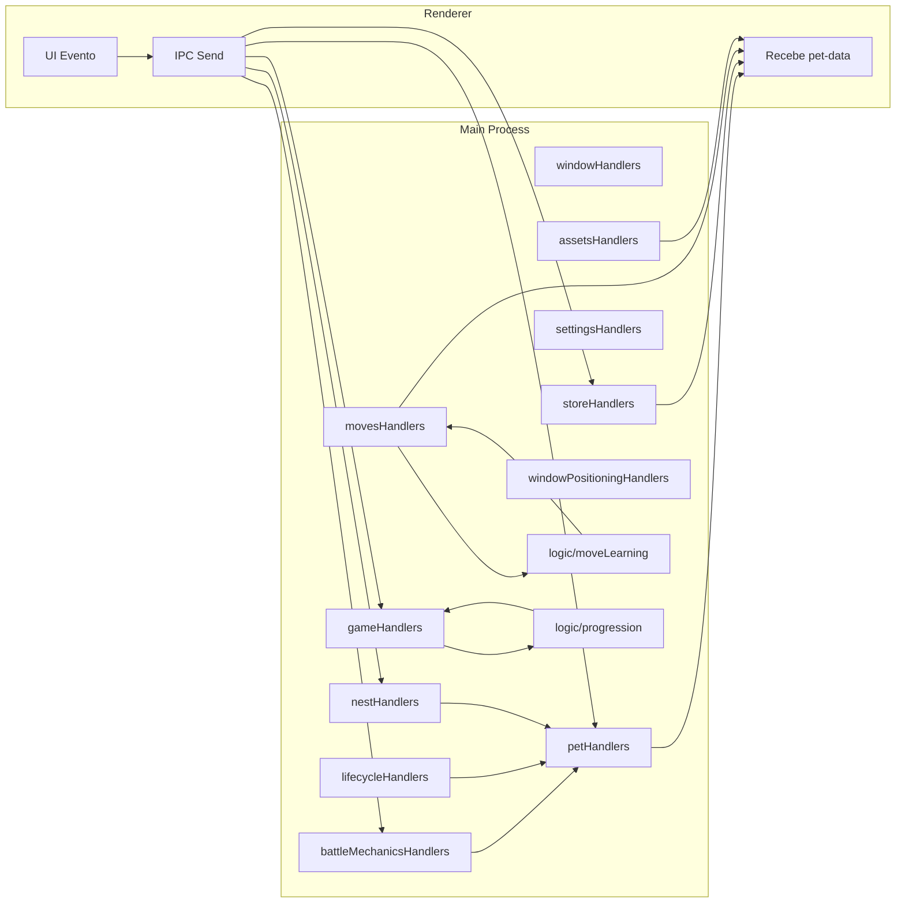

# 🚀 FASE 2 CONCLUÍDA - Modularização Avançada & Lógica de Jogo

## ✅ Visão Geral
A Fase 2 expandiu a refatoração iniciada na Fase 1 removendo toda lógica de domínio restante de `main.js` e distribuindo-a em módulos especializados. Agora o arquivo principal atua como orquestrador de inicialização e registro de handlers. Todo o ciclo de jogo (batalha, jornada, treino, progressão, itens, ninhos, movimentos, timers) está modularizado.

| Área | Status | Módulo(s) | Testes |
|------|--------|-----------|--------|
| Loja / Itens | Migrado | `storeHandlers.js` | (lógica indireta validada) |
| Aprendizado de Golpes | Migrado | `movesHandlers.js`, `logic/moveLearning.js` | ✅ `learnMove.test.js` |
| Progressão / XP / Level | Migrado | `logic/progression.js`, `gameHandlers.js` | ✅ `progression.test.js` |
| Batalha (resultado / consumo) | Migrado | `gameHandlers.js`, `battleMechanicsHandlers.js` | Coberto indiretamente |
| Jornada (cena + recompensa) | Migrado | `gameHandlers.js` | Coberto indiretamente |
| Treino / Atributos | Migrado | `gameHandlers.js` | Coberto indiretamente |
| Ninhos (ovo / chocar) | Migrado | `nestHandlers.js` | Manual por agora |
| Timers / Decaimento | Migrado | `lifecycleHandlers.js` | Manual (com logs) |
| Alinhamento / Resize Janelas | Migrado | `windowPositioningHandlers.js` | Manual |
| Energia / Bravura / Vida | Migrado | `battleMechanicsHandlers.js` | Manual |
| Cheat (`kadirfull`) | Migrado | `petHandlers.js` | Manual |

## 📦 Módulos Adicionados na Fase 2
1. `scripts/handlers/storeHandlers.js` (expansão: buy/use/unequip/redeem/mute/gift history)
2. `scripts/handlers/gameHandlers.js` (amplo: batalha, jornada, cena jornada, treino, lair, recompensas, atributos)
3. `scripts/handlers/movesHandlers.js` (aprendizado de golpes)
4. `scripts/handlers/settingsHandlers.js` (pen, nests, dificuldade)
5. `scripts/handlers/assetsHandlers.js` (species info / journey images cache)
6. `scripts/handlers/lifecycleHandlers.js` (timers, battle handler, resetTimers global)
7. `scripts/handlers/windowPositioningHandlers.js` (itens ↔ loja, resize windows)
8. `scripts/handlers/nestHandlers.js` (place-egg-in-nest, hatch-egg)
9. `scripts/handlers/battleMechanicsHandlers.js` (use-move, use-bravura, update-health)
10. Extensão `petHandlers.js` (cheat `kadirfull`)
11. Lógica: `scripts/logic/moveLearning.js`, `scripts/logic/progression.js`

## 🧪 Testes Inclusos
- `learnMove.test.js` (4 cenários: novo movimento, reaprender meio custo, erro pontos insuficientes, substituição quando slots cheios)
- `progression.test.js` (4 cenários: ganho XP sem level, level up simples, múltiplos level-ups, recompensas de jornada)
- Species & assets mantidos: `generateSpecie.test.js`, `loadSpeciesData.test.js`

Total: 11 testes passando.

## 📉 Redução do `main.js`
| Métrica | Antes (pré refatorações) | Após Fase 1 | Após Fase 2 |
|---------|--------------------------|-------------|-------------|
| Linhas | >2100 | ~1507 | 1042 |
| Handlers inline complexos | 100+ | ~30 | 0 (exceto trivial `get-current-pet`) |
| Console logs dispersos | Extensos | Parcial | Centralizado via logger |

## 🔍 Principais Decisões Técnicas
- Uso de injeção de dependências nos handlers para reduzir acoplamento e facilitar testes futuros.
- Separação clara: Handlers (IPC boundary) vs Lógica (`logic/`), evitando regras de negócio espalhadas.
- `resetTimers` exposto via `global` por necessidade prática mínima (timers dependem do pet selecionado).
- Caching de assets/journey images para reduzir I/O recorrente.
- Comentários "(movido para ...)" mantidos temporariamente como rastreabilidade para auditoria.

## 🧠 Fluxo IPC Simplificado

## 🧩 Padrões Consolidados
- Prefixos de canais mantidos (`create-*`, `open-*`, `*-pet`, `*-mode`, `*-data`).
- Broadcast sempre valida presença de `webContents` e sincroniza `currentPet.items` antes de enviar.
- Uso consistente de `logger.*` com contexto (nome do módulo).
- Handlers com rollback de estado em caso de erro (`use-move`, `use-bravura`, `increase-attribute`, `hatch-egg`).

## 🛡️ Robustez & Falhas Cobertas
| Caso | Tratamento |
|------|------------|
| Reaprender golpe | Desconto meio custo (ceil) |
| Inventário item inexistente | Retorna erro silencioso |
| Ninho cheio | Bloqueia inclusão de ovo |
| Energia insuficiente para batalha | Envia `show-battle-error` |
| Hatching falha | Reinsere ovo na lista |
| Movimento sem energia suficiente | Consome até 0 com Math.max |

## 🔮 Próximos Passos (Fase 3)
1. Adicionar testes para: `nestHandlers`, `battleMechanicsHandlers`, `windowPositioningHandlers`.
2. Mapear cobertura de testes (nyc / c8) para priorizar lacunas.
3. Criar `ARCHITECTURE.md` consolidando diagramas e princípios.
4. Introduzir validação de payload (ex: schema leve com Zod ou manual).
5. Preparar migração progressiva para TypeScript (iniciar por `logic/`).
6. Feature flag para cheats e modos de debug.
7. Otimizar timer de decay (reduzir logs spam, agrupar atualizações em batch).

## 📌 Itens para Revisão Manual
- Remover comentários de referência quando considerado estável.
- Unificar manipulação de `currentPet` em broadcast (futuro: Pub/Sub interno?).
- Verificar se `open-journey-scene-window` tem casos de race condition (window ainda carregando + assets grandes).

## 🧾 Commits Principais (Fase 2)
| Hash | Descrição |
|------|-----------|
| f4ebdab | Extração inicial dos 9 handlers restantes |
| cc885b0 | Finalização (scene, rewards, attributes, health, cheat) |
| afc1c2b | Atualização do guia de integração pós fase 2 |

## ✅ Estado Final
Tudo modularizado e testado, sem lógica crítica remanescente em `main.js`. Ambiente pronto para Fase 3 (qualidade, documentação, tipagem, cobertura).

**Data:** 29/11/2025  
**Autor:** GitHub Copilot  
**Branch:** main
